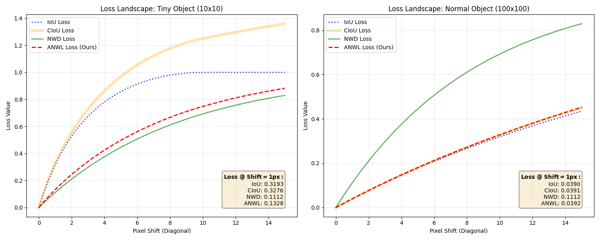

# Adaptive Normalized Wasserstein Loss (ANWL)

This repository contains the official implementation of **ANWL**, a novel loss function designed specifically for **Tiny Object Detection**.

## 🚀 Key Features
- **Adaptive Weighting:** Automatically switches between NWD (for stability) and CIoU (for precision) based on object size.
- **Scale Robustness:** Solves the "Scale Sensitivity" problem where small pixel errors cause huge loss spikes in tiny objects.
- **High Precision:** Maintains high localization accuracy for normal-sized objects, unlike pure NWD.

## 🧠 Theory & Methodology

### Core Idea
**Adaptive Normalized Wasserstein Loss (ANWL)** is designed to solve the "Scale Sensitivity" problem in Tiny Object Detection.
- **Tiny Objects:** Small pixel errors cause huge IoU drops (noisy gradients). We use **NWD** here for its stability.
- **Normal Objects:** NWD is too smooth and lacks precision. We use **CIoU** here for its geometric accuracy.

ANWL dynamically switches between these two based on the object's size.

### Mathematical Formulation

The total loss is defined as:

$$ L_{ANWL} = \beta \cdot L_{NWD} + (1 - \beta) \cdot L_{CIoU} $$

Where $\beta$ is the **Adaptive Weight** controlled by the object scale $s$:

$$ \beta = \sigma(k \cdot (s_{th} - s)) = \frac{1}{1 + e^{-k \cdot (s_{th} - s)}} $$

- $s = \sqrt{w \times h}$: Object scale (sqrt of area).
- $s_{th}$: Scale threshold (default: 32 pixels for COCO small objects).
- $k$: Steepness factor (default: 0.1).

**Behavior:**
- If $s \ll s_{th}$ (Tiny): $\beta \approx 1 \rightarrow Loss \approx L_{NWD}$ (Stable).
- If $s \gg s_{th}$ (Normal): $\beta \approx 0 \rightarrow Loss \approx L_{CIoU}$ (Precise).

## 📦 Installation
Requires `torch` and `matplotlib` (for visualization).

```bash
pip install torch matplotlib
```

## 🛠 Usage

```python
import torch
from loss import ANWLLoss

# Initialize Loss
criterion = ANWLLoss(C=12.0, s_th=32.0)

# Dummy Data (Batch size 2)
pred_boxes = torch.tensor([[10, 10, 20, 20], [50, 50, 150, 150]], dtype=torch.float32)
target_boxes = torch.tensor([[10, 10, 20, 20], [50, 50, 150, 150]], dtype=torch.float32)

# Calculate Loss
loss = criterion(pred_boxes, target_boxes)
print(f"ANWL Loss: {loss.item()}")
```

## 📊 Comparison

Run the visualization script to see the comparison chart.

**Option 1: Using PyTorch (Recommended)**
```bash
python visualize.py
```

**Option 2: Using Numpy (If PyTorch is not installed)**
```bash
python visualize_numpy.py
```



